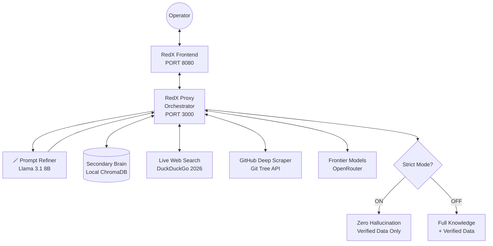

# 🔴 RedX v4.2 — AI-Powered Intelligence Orchestration Platform

**RedX** is an advanced, security-focused AI orchestration platform designed for professional red team operators, penetration testers, and security researchers. It features a **Multi-Brain Architecture** with live web intelligence, local persistent memory, an Extreme GitHub Deep Scraper, and frontier LLM reasoning — all wrapped in a premium dark-mode UI.


---

## 🧠 Multi-Brain Architecture

RedX operates using four distinct intelligence layers for every operation:

1.  **Secondary Brain (Local RAG)**: A private, persistent vector database (ChromaDB) stored on disk. Retrieves previous findings, exploit research, and recon data instantly without searching the web.
2.  **Main Brain (Reasoning)**: Powered by 120B–405B frontier models via OpenRouter. Handles complex logic, exploit development, and strategy.
3.  **Third Brain (Live Web)**: Real-time 2026 intelligence gathering via LangChain DuckDuckGo. Fetches the latest zero-days, CVEs, and tool updates.
4.  **Prompt Refiner (The Secretary)**: A dedicated Llama 3.1 8B agent that rewrites your raw prompts into highly structured, professional security missions before the main brain processes them.

---

## 🚀 Key Features

### 1. Extreme GitHub Deep Scraper
RedX can analyze **any GitHub repository** in seconds. When you paste a GitHub URL:
- **Git Tree API**: Maps the entire repo structure in a single API call (recursive tree).
- **Skill-Grouped Output**: Organizes files by skill/folder with `📁`/`📄` icons.
- **Concurrent Downloads**: Fetches up to 40 key files simultaneously from `raw.githubusercontent.com`.
- **Branch Fallback**: Automatically tries `main` → `master` branches.
- **URL Sanitization**: Strips trailing punctuation (`#`, `.`, `,`) from URLs.
- **Subdirectory Targeting**: Supports `/tree/branch/path` URLs for deep folder analysis.

### 2. Strict Scrutiny Mode (Anti-Hallucination)
A toggle-based dual-mode system:
- **🛡️ Strict Mode ON**: Zero hallucination. The AI can ONLY reference verified data from the scraper/search results and chat history. If the answer isn't in the data, it says "Information not found."
- **🧠 Standard Mode OFF**: The AI uses its full training knowledge alongside verified data for logical inference and broader explanations.

### 3. Prompt Refiner (Magic Wand 🪄)
Activates a secondary "Secretary" AI agent (Llama 3.1 8B) that:
- Analyzes your raw prompt for ambiguity and missing context.
- Rewrites it into a structured, professional security mission.
- Injects the refined prompt into the main AI's request.
- Displays the "Refined Mission" in the UI for transparency.

### 4. URL Memory System
RedX remembers GitHub URLs from your chat history. When you ask a follow-up question without pasting the URL again, it automatically recalls the last GitHub URL and re-fetches the repository data.

### 5. Mermaid.js Visualization Engine
- Renders flowcharts, sequence diagrams, and architecture diagrams directly in the chat.
- Uses Mermaid v11 loaded as an ES Module for browser compatibility.
- Automatic detection and rendering of `mermaid` code blocks.

### 6. Autonomous Knowledge Ingestion
RedX doesn't just find information; it **learns**:
- **Distills**: Summarizes messy search results into high-density security intelligence.
- **Ingests**: Stores the summary in your local Secondary Brain.
- **Deduplicates**: Ensures your knowledge base remains elite and clutter-free.

### 7. Chat Management
- **🗑️ Delete Chat**: Removes conversations from both UI and localStorage instantly.
- **✏️ Rename Chat**: Rename any conversation from the top navigation bar.
- **✎ Edit / Retry Prompt**: Click "Edit" on any sent message to modify it and re-send. The chat history truncates cleanly to that point.

### 8. Knowledge Vault UI
Manage your agent's memory from the sidebar. The **Vault Tab** allows you to view, search, and delete specific knowledge chunks.

---

## 🏗 System Architecture



---

## 🔄 Request Pipeline

```
User Prompt
    │
    ├─ 🪄 Prompt Refiner (if enabled) → Refined Mission
    │
    ├─ 🧠 Local RAG Search → Previous findings
    │
    ├─ 📡 URL Detection
    │   ├─ GitHub URL found → Extreme Deep Scraper (Git Tree API)
    │   ├─ Other URL found → Direct webpage fetch (BeautifulSoup)
    │   ├─ No URL (URL Memory) → Recall GitHub URL from chat history
    │   └─ No URL found → DuckDuckGo Live Search
    │
    ├─ 📥 Knowledge Distillation & Ingestion → ChromaDB
    │
    ├─ 🛡️ Context Injection (Strict or Standard mode)
    │
    └─ 🤖 Frontier LLM Response (max_tokens: 16384)
```

---

## 🛠 Setup & Installation

### 1. Requirements
- **Python**: 3.10 or higher
- **Disk Space**: ~500MB (for local vector storage)
- **OpenRouter API Key**: Required for LLM access

### 2. Installation

```bash
# Clone the repository
git clone https://github.com/Smaster21/RedX.git
cd RedX

# Install core dependencies
pip install chromadb sentence-transformers torch aiohttp flask flask-cors langchain-openai langchain-community duckduckgo-search beautifulsoup4
```

### 3. Running RedX

```bash
# Start the Backend Proxy (Port 3000)
python3 proxy.py

# Start the Frontend UI (Port 8080) - in a separate terminal
python3 -m http.server 8080
```

Then open **http://localhost:8080** in your browser.

> **Important**: After any backend update, perform a **Hard Refresh** (`Ctrl + Shift + R`) to clear the browser cache and load the latest JavaScript.

---

## 📖 Operational Guide

1.  **Unlock the Brain**: Go to the Sidebar and unlock your **API Vault** with your OpenRouter key.
2.  **Choose Your Mode**: Toggle **Strict Scrutiny** on/off depending on your need:
    - **ON** for fact-checking, code analysis, and zero-hallucination verification.
    - **OFF** for brainstorming, inference, and broad explanations.
3.  **Analyze a Repo**: Paste a GitHub URL and ask RedX to explain the skills, files, or architecture.
4.  **Build Knowledge**: Ask about a 2026 exploit. Watch as RedX searches the web and shows `📥 Ingesting new knowledge...`
5.  **Manage Memory**: Click the **"Secondary Brain"** button in the sidebar to open the Vault.
6.  **Visualize**: Ask for a flowchart or diagram. RedX renders Mermaid diagrams directly in the chat.

---

## 📁 Project Structure

```
OPENROUTE/
├── proxy.py          # Backend orchestrator (Flask, port 3000)
├── app.js            # Frontend logic (chat, rendering, state)
├── index.html        # Main HTML interface
├── style.css         # Premium dark-mode styling
├── README.md         # This file
├── .redx_knowledge/  # Local ChromaDB vector database
└── last_context.log  # Debug audit log (last request context)
```

---

## 🔐 Changelog (v4.2)

### New Features
- ✅ **Extreme GitHub Deep Scraper** — Git Tree API + concurrent file downloads
- ✅ **Prompt Refiner** — Llama 3.1 8B "Secretary" agent
- ✅ **Strict/Standard Mode Toggle** — Dynamic backend switching
- ✅ **URL Memory** — Auto-recall GitHub URLs from chat history
- ✅ **Mermaid v11 ES Module** — Stable diagram rendering
- ✅ **Chat Rename / Delete / Edit-Retry** — Full chat management

### Bug Fixes
- 🔧 Fixed GitHub URL parser (trailing `#`, `.`, `?` stripped)
- 🔧 Fixed `main` → `master` branch fallback
- 🔧 Fixed Strict Mode backend disconnect (UI toggle now respected)
- 🔧 Fixed `max_tokens` default (increased to 16384)
- 🔧 Fixed Prompt Refiner injection into final LLM payload

---

## ⚖️ License & Ethics

RedX is intended for **authorized penetration testing and security research only**. The developers are not responsible for any misuse. Always operate within legal boundaries and with explicit authorization.

---

**Built for the next generation of autonomous offensive security.** 🔴
