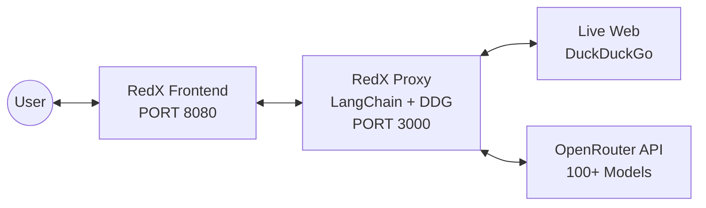

# 🔴 RedX — Real-Time Autonomous Red Team Chatbot

**RedX** is a high-performance, security-focused AI chatbot designed for professional penetration testers, researchers, and technical analysts. Built on the **RedX Architecture**, it bridges the knowledge gap of standard LLMs by integrating real-time web search and strict factual guardrails.


---

## 🚀 Key Features

### 1. Real-Time 2026 Intelligence
RedX uses **Search-Augmented Generation (SAG)** to fetch live data from the web via DuckDuckGo. It can identify vulnerabilities, tool updates, and geopolitical events disclosed as recently as **today**, even if the underlying model's training ended years ago.

### 2. Strict-RAG Guardrails (Anti-Hallucination)
Unlike standard chatbots that "guess" when they don't know an answer, RedX is programmed with a **Strict-RAG** protocol.
- **Deterministic Reasoning**: Forced `temperature: 0.1` for absolute literal accuracy.
- **Verification Rule**: If a specific technical detail (CVE, version, exploit path) is not found in the live search results, RedX outputs **"Information Not Found"** instead of hallucinating.

### 3. Fortinet & Corporate Proxy Bypass
Designed for use in restricted environments, the RedX Proxy includes a built-in SSL-bypass layer that allows it to function behind Fortinet SSL inspection and other corporate firewalls without certificate errors.

### 4. Client-Side Encrypted Vault
Your API keys never leave your machine in plain text. RedX uses a **browser-based AES-256-GCM Vault** to encrypt your keys with a master password. Decryption happens only in memory at runtime.

---

## 🏗 Architecture



---

## 🛠 Setup & Installation

### 1. Clone the Repository
```bash
git clone https://github.com/your-username/RedX.git
cd RedX
```

### 2. Backend Setup (The Proxy)
The proxy handles the search-augmentation and SSL bypass.
```bash
# Install dependencies
pip install -r requirements.txt

# Run the proxy
python3 proxy.py
```
*The proxy will start on `http://localhost:3000`.*

### 3. Frontend Setup
Serve the HTML/JS frontend using any web server.
```bash
# Example using Python
python3 -m http.server 8080
```
*Open your browser to `http://localhost:8080`.*

---

## 📖 How to Use

1.  **Get an API Key**: Visit [OpenRouter.ai](https://openrouter.ai/) and generate an API key.
2.  **Unlock the RedX Vault**:
    - Open the sidebar in RedX.
    - Enter your API key and set a Vault Password.
    - Click **Create Vault**.
3.  **Choose a Model**: Select a high-reasoning model (e.g., **GPT-OSS 120B** or **Llama 3.1 405B**).
4.  **Start Researching**: Ask technical questions about 2026 events. RedX will automatically perform searches and provide "Search-Augmented" responses.

---

## ⚖️ License & Ethics
RedX is intended for **authorized penetration testing and security research only**. The developers are not responsible for any misuse of this tool. Always operate within the boundaries of the law and with explicit authorization from the target owner.

---
**Developed for the Red Team Community.** 🔴
