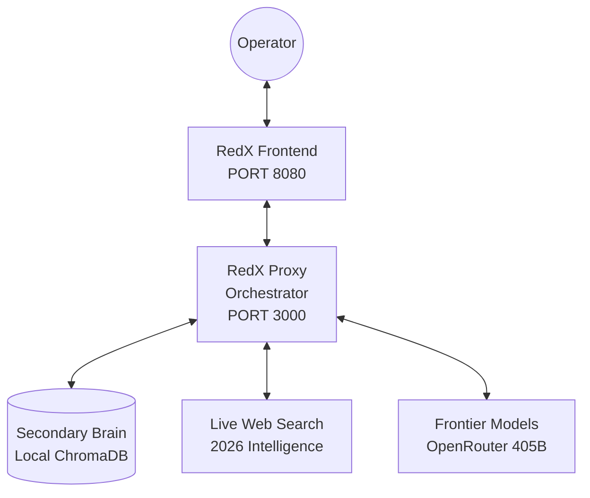

# 🔴 RedX v3.1 — Autonomous Operational Intelligence Agent

**RedX** is an advanced, security-focused AI orchestration platform designed for professional red team operators and penetration testers. Unlike standard chatbots, RedX features a **Triple-Brain Architecture** that combines local persistent memory, live 2026 web intelligence, and frontier LLM reasoning.


---

## 🧠 Triple-Brain Architecture

RedX operates using three distinct layers of intelligence for every operation:

1.  **Secondary Brain (Local RAG)**: A private, persistent vector database (ChromaDB) stored on your disk. It retrieves previous findings, exploit research, and recon data instantly without searching the web.
2.  **Main Brain (Reasoning)**: Powered by 405B+ frontier models via OpenRouter. Handles complex logic, exploit development, and strategy.
3.  **Third Brain (Live Web)**: Real-time 2026 intelligence gathering via LangChain. Fetches the latest zero-days, CVEs, and tool updates Disclosure as recently as **today**.

---

## 🚀 Key Features

### 1. Autonomous Knowledge Ingestion
RedX doesn't just find information; it **learns**. When it discovers new data on the web, it automatically:
- **Distills**: Summarizes messy search results into high-density security intelligence.
- **Ingests**: Stores the summary in your local Secondary Brain.
- **Deduplicates**: Ensures your knowledge base remains elite and clutter-free.

### 2. Knowledge Vault UI
Manage your agent's memory directly from the interface. The **Vault Tab** allows you to view, search, and delete specific knowledge chunks, giving you 100% control over what your agent "remembers."

### 3. Strict-RAG Protocol (Anti-Hallucination)
- **Deterministic Reasoning**: Forced `temperature: 0.1` for absolute technical accuracy.
- **Context Priority**: Live 2026 data and Local Memory always override the model's base training.

---

## 🏗 System Design



---

## 🛠 Setup & Installation

### 1. Requirements
- **Python**: 3.10 or higher.
- **Disk Space**: ~500MB (for local vector storage).

### 2. Installation

```bash
# Clone the repository
git clone https://github.com/Smaster21/RedX.git
cd RedX

# Install core dependencies
pip install chromadb sentence-transformers torch aiohttp flask flask-cors langchain-openai langchain-community
```

### 3. Running RedX

Run both the backend proxy and the frontend server:

```bash
# Start the Backend Proxy (Port 3000)
python3 proxy.py

# Start the Frontend UI (Port 8080)
python3 -m http.server 8080
```

---

## 📖 Operational Guide

1.  **Unlock the Brain**: Go to the Sidebar and unlock your **API Vault** with your OpenRouter key.
2.  **Build Knowledge**: Ask about a new 2026 exploit. Watch as RedX searches the web and shows `📥 Ingesting new knowledge...`
3.  **Manage Memory**: Click the **"Secondary Brain"** button in the sidebar to open the Vault and manage your stored intelligence.
4.  **Offline Advantage**: Once knowledge is stored, RedX can answer questions about it **without an internet connection** (using local RAG).

---

## ⚖️ License & Ethics

RedX is intended for **authorized penetration testing and security research only**. The developers are not responsible for any misuse. Always operate within legal boundaries and with explicit authorization.

---

**Built for the next generation of autonomous offensive security.** 🔴
